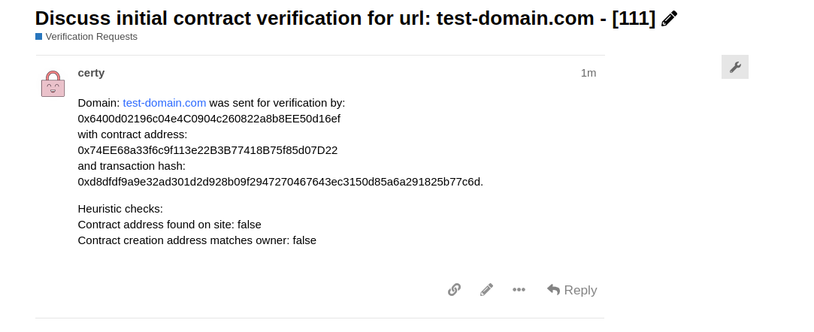

## Registration Walkthrough

1. Contract Owner navigates to **www.certdao.net**.

	

2. Contract Owner connects their wallet and enters the URL users navigate to to interact with the deployed contract and deployed contract address.

	

3. Contract Owner submits the information to the *certDAO* backend which validates that:
	- The smart contract lives on the URL entered.
	- The user connected wallet is the owner of the contract.

 	 The results of the validation are displayed to the user.

	

4. If the contract owner proceeds, the contract owner pays a small fee (currently **0.05 ETH**) to the DAO. This fee is used to help support the DAO and prevent spam.

	

5. Once the transaction is mined (initial registration status set to `pending`), a governance discussion on discourse is created with the information provided by the contract owner.

	

6. For the next 7 days, the contract is set to pending. If the registration passes both of the above heuristics (contract owner submitted, contract lives on domain), contract will be auto-approved if no issues raised in governance.

7. You can view the status of all your registration in the registration tab.

	

### Current Rules

- Currently, only contracts deployed on the Ethereum mainnet are supported.
- Only one domain (URL) can be registered per contract.
- Registration is valid for 1 year from initial registration.
- The DAO can revoke a registration anytime.

